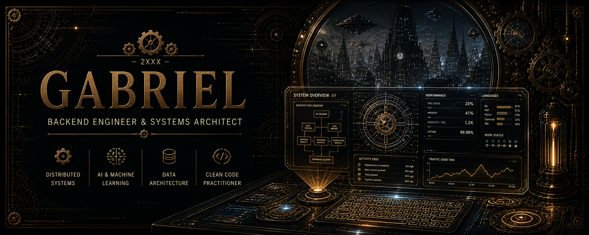

# Gabriel

> Backend Engineer — Systems, Distributed Architectures, AI

---

## ⚙️ Stack

`Go` `Laravel` `PostgreSQL` `Redis` `RabbitMQ` `APIs` `RAG (AI)`

---

## 🧪 Current Focus

- Retrieval-Augmented Generation (RAG)
- Real-time event-driven systems
- Distributed architectures
- AI tooling & automation

---

## 📊 Activity

---

## 🧾 Notes

<!-- START_SECTION:posts -->
- Coming soon.
<!-- END_SECTION:posts -->

---

## 📡 Architecture Mindset

> Systems should be deterministic, observable, and scalable by design — not by accident.

---

## 📫 Contact

- LinkedIn: https://www.linkedin.com/in/gabriel-santos-5ab793120/
- Email: gabriel.santos2350@proton.me

---

<!--
Visual System: Steampunk × Futuristic Minimalism

- Base: deep industrial dark (#1a1410 / #14110f)
- Primary metal: aged copper (#b87333)
- Highlight: warm gold (#e6c068 / #d4af37)
- Secondary text: oxidized brass (#c9a44c / #8f7a58)

Design Principles:
- Mechanical aesthetic with functional intent (gears as structure, not decoration)
- Subtle sci-fi overlay (HUD, holographic interfaces, system panels)
- High contrast hierarchy (metrics > labels > metadata)
- Minimalist layout with strict spacing and alignment
- Zero visual noise — every element must justify its presence

Consistency Rules:
- All dynamic widgets must follow the same color system
- Avoid pure black backgrounds; prefer warm industrial tones
- Typography must remain clean and readable (no ornamental excess)
- Icons and symbols should feel engineered, not illustrative

Philosophy:
- This is not a theme — it is a system
- Industrial precision + futuristic control interface
-->